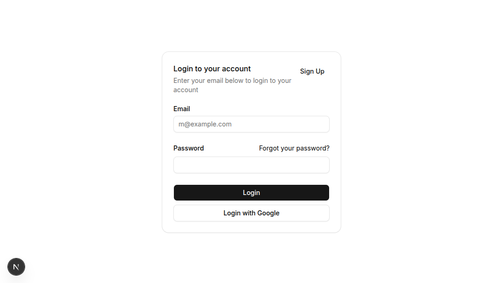
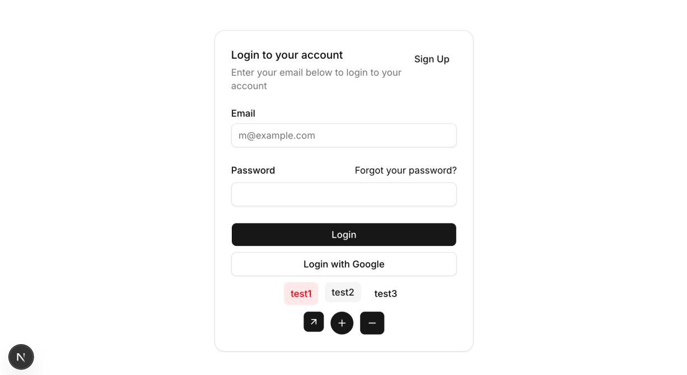
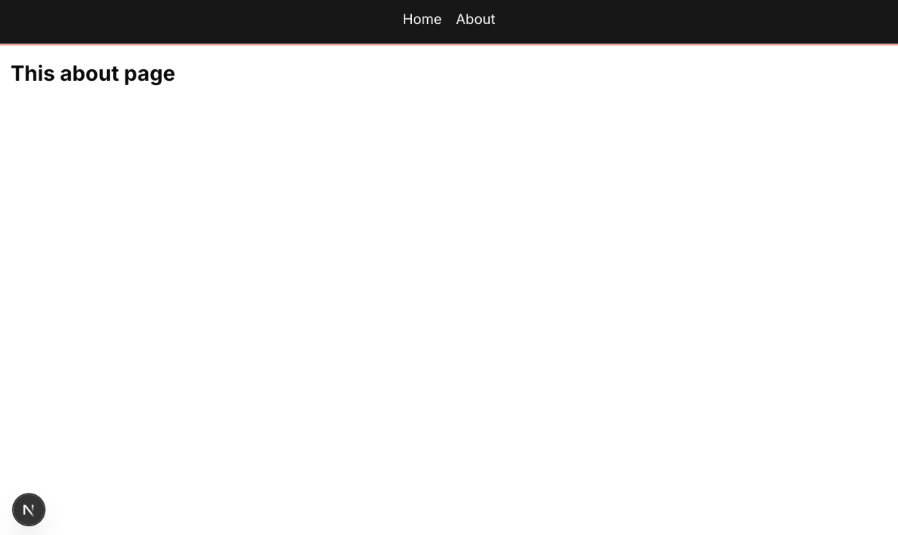

# Step 01 — Setup & Basics

Goal: scaffold a Next.js project, install shadcn UI, explore components, and learn file-based routing.

---

## 1. Create the Project

```bash
npx create-next-app@latest snippets
cd snippets
npm install
npm run dev
```

When prompted, choose **"Yes, use recommended defaults"**. Leave everything at the defaults.

---

## 2. Install shadcn UI

shadcn UI is different from a typical npm package — it **copies component source code directly into your project**, so you can customize every line.

```bash
npx shadcn@latest init
```

This creates a `components.json` config file at the root. Component files will appear in `components/ui/` as you add them.

### Add the components we need

```bash
npx shadcn@latest add button
npx shadcn@latest add card
npx shadcn@latest add input
npx shadcn@latest add textarea
npx shadcn@latest add label
npx shadcn@latest add field
```

Open `components/ui/button.tsx` — you're looking at the full implementation. It's yours to change.

---

## 3. Use shadcn Components

Replace the contents of `app/page.tsx` with a Card example from the shadcn docs (copy it from https://ui.shadcn.com/docs/components/card). Make sure to export it as `Home`:

```tsx
// app/page.tsx
import { Button } from "@/components/ui/button";
import {
  Card,
  CardAction,
  CardContent,
  CardDescription,
  CardFooter,
  CardHeader,
  CardTitle,
} from "@/components/ui/card";
import { Input } from "@/components/ui/input";
import { Label } from "@/components/ui/label";

export default function Home() {
  return (
    <div className="w-full h-full flex justify-center items-center p-8 flex-1">
      <Card className="w-full max-w-sm">
        <CardHeader>
          <CardTitle>Login to your account</CardTitle>
          <CardDescription>Enter your email below to login to your account</CardDescription>
          <CardAction>
            <Button variant="link">Sign Up</Button>
          </CardAction>
        </CardHeader>
        <CardContent>
          <form>
            <div className="flex flex-col gap-6">
              <div className="grid gap-2">
                <Label htmlFor="email">Email</Label>
                <Input id="email" type="email" placeholder="m@example.com" required />
              </div>
              <div className="grid gap-2">
                <div className="flex items-center">
                  <Label htmlFor="password">Password</Label>
                  <a href="#" className="ml-auto inline-block text-sm underline-offset-4 hover:underline">
                    Forgot your password?
                  </a>
                </div>
                <Input id="password" type="password" required />
              </div>
            </div>
          </form>
        </CardContent>
        <CardFooter className="flex-col gap-2">
          <Button type="submit" className="w-full">
            Login
          </Button>
          <Button variant="outline" className="w-full">
            Login with Google
          </Button>
        </CardFooter>
      </Card>
    </div>
  );
}
```



### Exploring Button variants

shadcn components use **props** to control visual styles. Hover over `Button` in VSCode to see all available props via TypeScript types.

```tsx
{/* variant — color/style */}
<Button variant="default">Default</Button>
<Button variant="destructive">Destructive (red)</Button>
<Button variant="outline">Outline</Button>
<Button variant="secondary">Secondary</Button>
<Button variant="ghost">Ghost</Button>
<Button variant="link">Link</Button>

{/* size */}
<Button size="sm">Small</Button>
<Button size="default">Default</Button>
<Button size="lg">Large</Button>
<Button size="icon">Icon</Button>

{/* icon buttons with lucide-react. The size of the icon type is equal in height and width, which is more suitable for displaying icons.*/}
<Button size="icon">
  <Plus className="size-4" />
</Button>
<Button size="icon-sm">
  <ArrowUpRight className="size-4" />
</Button>
```

We can add some new buttons to the Home component example we just created for testing.



---

## 4. File-Based Routing

Next.js App Router routing is straightforward: **folder name = URL segment, and `page.tsx` inside it = the page at that URL**.

### Create an About page

```
app/
└── about/
    └── page.tsx   →  http://localhost:3000/about
```

```tsx
// app/about/page.tsx
export default function About() {
  return (
    <div className="flex-1 flex flex-col items-center">
      <div className="flex-1 max-w-7xl w-full p-4">
        <h1 className="text-2xl font-bold">This about page</h1>
      </div>
    </div>
  );
}
```

Visit http://localhost:3000/about — it just works.

### Route structure overview

```
app/
├── page.tsx              →  /
├── about/
│   └── page.tsx          →  /about
└── snippets/
    ├── page.tsx          →  /snippets        (Step 04)
    └── [id]/
        ├── page.tsx      →  /snippets/123    (Step 03)
        └── edit/
            └── page.tsx  →  /snippets/123/edit  (Step 04)
```

Square brackets `[id]` denote **dynamic segments** — covered in Step 03.

---

## 5. Layout & Global Navigation

`app/layout.tsx` is the **root layout** — it wraps every page. This is the right place to put a global navigation bar.

### Create the Header component

```tsx
// components/Header.tsx
import Link from "next/link";

export default function Header() {
  return (
    <div className="w-full p-4 border-b bg-primary text-primary-foreground flex items-center justify-center">
      <nav className="flex gap-4">
        <Link href="/">Home</Link>
        <Link href="/about">About</Link>
      </nav>
    </div>
  );
}
```

`Link` is Next.js's client-side navigation component. It pre-fetches pages and navigates without a full browser reload.

### Add Header to the root layout

```tsx
// app/layout.tsx
import type { Metadata } from "next";
import { Geist, Geist_Mono } from "next/font/google";
import "./globals.css";
import Header from "@/components/Header";

const geistSans = Geist({ variable: "--font-geist-sans", subsets: ["latin"] });
const geistMono = Geist_Mono({ variable: "--font-geist-mono", subsets: ["latin"] });

export const metadata: Metadata = {
  title: "Snippets",
  description: "A code snippet manager",
};

export default function RootLayout({ children }: Readonly<{ children: React.ReactNode }>) {
  return (
    <html lang="en" className={`${geistSans.variable} ${geistMono.variable}`}>
      <body className="min-h-screen flex flex-col">
        <Header />
        {children}
      </body>
    </html>
  );
}
```

`children` is the content rendered by the current route's `page.tsx`. With `Header` here, the nav bar appears on every page automatically.

---



## Summary

| Concept      | Key Point                                                                                |
| ------------ | ---------------------------------------------------------------------------------------- |
| shadcn UI    | Component source is copied into your project; control styles via `variant`, `size` props |
| File routing | Folder name = URL segment; `page.tsx` = the page at that path                            |
| Layout       | `layout.tsx` wraps all child pages — ideal for global nav and shared styles              |
| `Link`       | Client-side navigation without full page reloads                                         |
