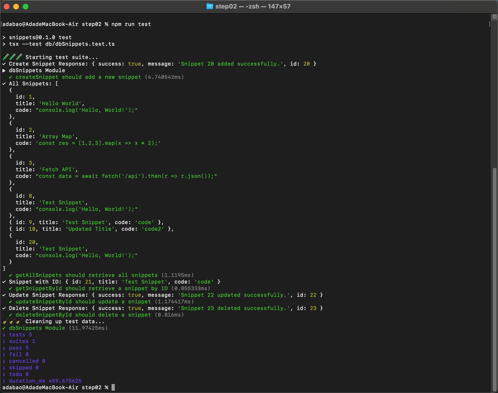

# Step 02 — SQLite Database

Goal: add a SQLite database, write CRUD functions for the snippets table, and verify them with tests.

---

## 1. Install Dependencies

```bash
npm install sqlite sqlite3
npm install tsx --save-dev
```

- `sqlite3` — native SQLite bindings for Node.js
- `sqlite` — Promise wrapper around `sqlite3` so we can use `async/await`
- `tsx` — runs TypeScript files directly in Node.js without a separate compile step

---

## 2. Directory Structure

Create two new directories at the project root:

```
project/
├── data/
│   └── dev.sqlite          # SQLite file (auto-created on first run)
├── db/
│   ├── dbClient.ts         # Database connection manager
│   ├── dbSnippets.ts       # CRUD functions for the snippets table
│   ├── dbSnippets.test.ts  # Tests
│   └── index.ts            # Re-export barrel
└── ...
```

---

## 3. Database Client (Singleton)

`db/dbClient.ts` manages the database connection and initializes the schema on first use.

We use the **Singleton pattern(单例模式)** — the whole app shares one connection instance.

```ts
// db/dbClient.ts
import sqlite3 from "sqlite3";
import { open, Database } from "sqlite";

const DBPATH = "./data/dev.sqlite";

export class DbClient {
  private db: Database | null = null;
  private static instance: DbClient | null = null;
  private initPromise: Promise<void> | null = null;

  private constructor() {}

  public static getInstance(): DbClient {
    if (!this.instance) {
      this.instance = new DbClient();
    }
    return this.instance;
  }

  public async getConnection(): Promise<Database> {
    if (!this.db) {
      this.db = await open({
        filename: DBPATH,
        driver: sqlite3.Database,
      });
    }
    // Run initialization exactly once, even under concurrent calls
    if (!this.initPromise) {
      this.initPromise = this.initializeDatabase();
    }
    await this.initPromise;
    return this.db;
  }

  private async initializeDatabase(): Promise<void> {
    const db = this.db!;

    // Create table if it doesn't exist
    await db.exec(`
      CREATE TABLE IF NOT EXISTS snippets (
        id    INTEGER PRIMARY KEY AUTOINCREMENT,
        title TEXT,
        code  TEXT
      );
    `);

    // Seed with sample data on a fresh database
    const { count } = (await db.get(`SELECT COUNT(*) as count FROM snippets`)) as { count: number };

    if (count === 0) {
      await db.run(`INSERT INTO snippets (title, code) VALUES (?, ?), (?, ?), (?, ?)`, [
        "Hello World",
        "console.log('Hello, World!');",
        "Array Map",
        "const res = [1,2,3].map(x => x * 2);",
        "Fetch API",
        "const data = await fetch('/api').then(r => r.json());",
      ]);
    }
  }
}

export interface Snippet {
  id: number;
  title: string;
  code: string;
}
```

**Why Singleton?**

- `private constructor` prevents calling `new DbClient()` directly
- `static getInstance()` ensures only one instance exists
- `initPromise` guards against running the schema setup more than once even if multiple requests call `getConnection()` simultaneously

---

## 4. CRUD Functions

`db/dbSnippets.ts` exposes one function per operation:

```ts
// db/dbSnippets.ts
import { DbClient, type Snippet } from "./dbClient";

const client = DbClient.getInstance();

export interface SnippetResponse {
  success: boolean;
  message: string;
  id: number;
}

export async function getAllSnippets(): Promise<Snippet[]> {
  const db = await client.getConnection();
  return db.all("SELECT id, title, code FROM snippets");
}

export async function getSnippetById(id: number): Promise<Snippet | undefined> {
  const db = await client.getConnection();
  return db.get("SELECT id, title, code FROM snippets WHERE id = ?", [id]);
}

export async function createSnippet(title: string, code: string): Promise<SnippetResponse> {
  const db = await client.getConnection();
  const result = await db.run("INSERT INTO snippets (title, code) VALUES (?, ?)", [title, code]);
  return {
    success: true,
    message: `Snippet ${result.lastID} added successfully.`,
    id: result.lastID!,
  };
}

export async function deleteSnippetById(id: number): Promise<SnippetResponse> {
  const db = await client.getConnection();
  const result = await db.run("DELETE FROM snippets WHERE id = ?", [id]);
  if (result.changes === 0) throw new Error(`Snippet with id ${id} not found.`);
  return { success: true, message: `Snippet ${id} deleted successfully.`, id };
}

export async function updateSnippetById(id: number, title: string, code: string): Promise<SnippetResponse> {
  const db = await client.getConnection();
  const result = await db.run("UPDATE snippets SET title = ?, code = ? WHERE id = ?", [title, code, id]);
  if (result.changes === 0) throw new Error(`Snippet with id ${id} not found.`);
  return { success: true, message: `Snippet ${id} updated successfully.`, id };
}
```

Always use `?` placeholders instead of string interpolation — this prevents SQL injection.

---

## 5. Barrel Export

```ts
// db/index.ts
export * from "./dbClient";
export * from "./dbSnippets";
```

Pages can now do `import { getAllSnippets } from "@/db"` — clean and simple.

---

## 6. Tests

We use Node.js's built-in `node:test` and `node:assert` — no extra test framework needed.

```ts
// db/dbSnippets.test.ts
import test, { describe, before, after } from "node:test";
import assert from "node:assert";
import { getAllSnippets, getSnippetById, createSnippet, deleteSnippetById, updateSnippetById } from "./dbSnippets";

describe("dbSnippets Module", () => {
  let createdIds: number[] = [];

  before(() => {
    console.log("🧪 Starting test suite...");
  });

  after(async () => {
    // Clean up rows created during tests
    console.log("🧹 Cleaning up test data...");
    for (const id of createdIds) {
      await deleteSnippetById(id);
    }
  });

  test("createSnippet should add a new snippet", async () => {
    const response = await createSnippet("Test Snippet", "console.log('Hello, World!');");
    assert(response.success, "create snippet should succeed");
    createdIds.push(response.id);
  });

  test("getAllSnippets should retrieve all snippets", async () => {
    const snippets = await getAllSnippets();
    assert(Array.isArray(snippets), "snippets should be an array");
  });

  test("getSnippetById should retrieve a snippet by ID", async () => {
    const created = await createSnippet("Test Snippet", "code");
    createdIds.push(created.id);
    const snippet = await getSnippetById(created.id);
    assert(snippet !== undefined, "snippet should exist");
    assert(snippet.id === created.id, "IDs should match");
  });

  test("updateSnippetById should update a snippet", async () => {
    const created = await createSnippet("Original", "code1");
    createdIds.push(created.id);
    const response = await updateSnippetById(created.id, "Updated Title", "code2");
    assert(response.success);
    const updated = await getSnippetById(created.id);
    assert(updated?.title === "Updated Title");
    assert(updated?.code === "code2");
  });

  test("deleteSnippetById should delete a snippet", async () => {
    const created = await createSnippet("To Delete", "code");
    createdIds.push(created.id);
    const response = await deleteSnippetById(created.id);
    assert(response.success);
    createdIds = createdIds.filter((id) => id !== created.id);
  });
});
```

### Add the test script to package.json

```json
{
  "scripts": {
    "dev": "next dev",
    "build": "next build",
    "start": "next start",
    "lint": "eslint",
    "test": "tsx --test db/dbSnippets.test.ts"
  }
}
```

### Run the tests

```bash
npm run test
```

All 5 tests should pass. If they do, the database layer is solid and we can move on.



---

## Summary

| Concept               | Key Point                                                                            |
| --------------------- | ------------------------------------------------------------------------------------ |
| Singleton             | `private constructor` + `static getInstance()` — one DB connection for the whole app |
| Lazy init             | `initPromise` ensures schema setup runs exactly once regardless of concurrency       |
| Parameterized queries | Use `?` placeholders, never string interpolation — prevents SQL injection            |
| `node:test`           | Node.js 18+ ships a built-in test runner; no extra dependencies needed               |
