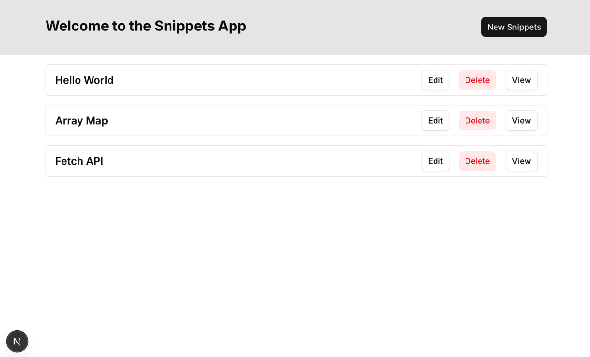
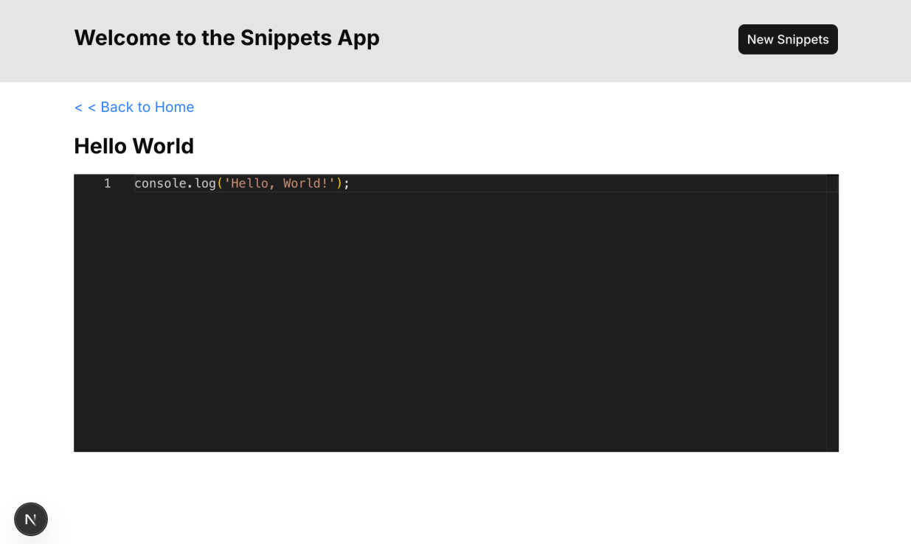
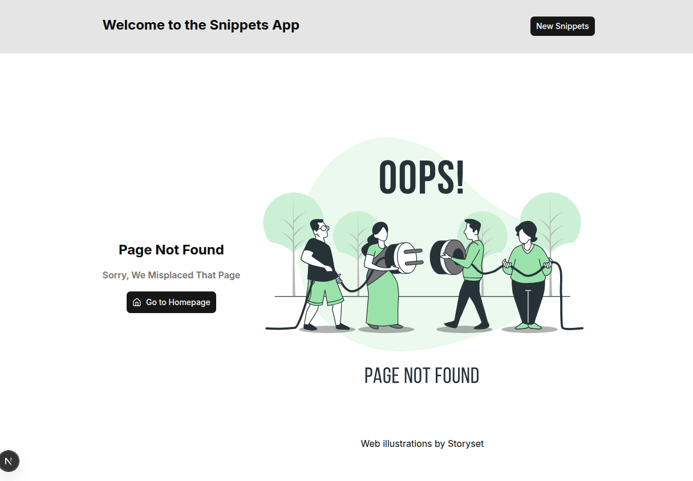

# Step 03 — View & Delete

Goal: build the home page snippet list, a detail view with syntax highlighting, and delete functionality using Server Actions.

---

## 1. Home Page — Snippet List

The home page fetches all snippets from the database and renders them as a list. Each row has Edit, Delete, and View buttons.

```tsx
// app/page.tsx
import Link from "next/link";
import { getAllSnippets, deleteSnippetById } from "@/db";
import { Button } from "@/components/ui/button";
import { revalidatePath } from "next/cache";

export default async function Home() {
  const snippets = await getAllSnippets();

  return (
    <div className="w-full max-w-4xl p-4">
      <ul className="flex flex-col gap-4">
        {snippets.map((s) => (
          <div key={s.id} className="px-4 py-2 border rounded flex items-center justify-between">
            <h2 className="text-lg font-semibold">{s.title}</h2>
            <div className="flex gap-4">
              <Button variant="outline" asChild>
                <Link href={`/snippets/${s.id}/edit`}>Edit</Link>
              </Button>
              <Button variant="destructive">Delete</Button>
              <Button variant="outline" asChild>
                <Link href={`/snippets/${s.id}`}>View</Link>
              </Button>
            </div>
          </div>
        ))}
      </ul>
    </div>
  );
}
```



**Key things to notice:**

- `Home` is an `async` function — Next.js Server Components can be async, so you can `await` database calls directly at the top level. No `useEffect`, no loading state.
- `Button` with `asChild` — shadcn's `asChild` prop renders the Button's styles onto its child element (the `Link`) instead of wrapping it in an extra `<button>`.

---

## 2. View Page — Dynamic Route

Create the route `app/snippets/[id]/page.tsx`. The `[id]` folder name makes this a **dynamic route** — Next.js captures whatever is in that URL segment and passes it to the page as a param.

```tsx
// app/snippets/[id]/page.tsx
import { getSnippetById } from "@/db";
import { notFound } from "next/navigation";
import Link from "next/link";

interface SnippetPageProps {
  params: Promise<{ id: string }>;
}

export default async function SnippetPage({ params }: SnippetPageProps) {
  const { id } = await params;
  const snippet = await getSnippetById(Number(id));

  if (!snippet) {
    notFound(); // renders not-found.tsx (covered below)
  }

  return (
    <div className="w-full max-w-4xl p-4 flex flex-col gap-4">
      <Link href="/" className="text-blue-500 hover:underline">
        &lt;&lt; Back to Home
      </Link>
      <h2 className="text-2xl font-bold">{snippet.title}</h2>
      <p>{snippet.code}</p>
    </div>
  );
}
```

Note that in Next.js 15+, `params` is a **Promise** and must be `await`-ed before accessing its properties.

---

## 3. CodeViewer Component

The view page needs syntax-highlighted, read-only code display. We use Monaco Editor (the same editor that powers VS Code).

```bash
npm install @monaco-editor/react
```

```tsx
// components/CodeViewer.tsx
"use client";

import Editor from "@monaco-editor/react";

interface CodeViewerProps {
  code: string;
}

export default function CodeViewer({ code }: CodeViewerProps) {
  return (
    <Editor
      height="50vh"
      language="typescript"
      value={code}
      theme="vs-dark"
      options={{
        readOnly: true,
        minimap: { enabled: false },
        fontSize: 14,
        tabSize: 2,
      }}
    />
  );
}
```

**Why `"use client"` here?**

Monaco Editor loads a large JavaScript bundle in the browser (language workers, syntax highlighting engine, etc.). It can only run on the client side. The `"use client"` directive marks this component as a Client Component, so Next.js knows to ship its code to the browser.

Load CodeViewer in app/snippets/[id]/page.tsx to ensure the page displays correctly.

```tsx
// app/snippets/[id]/page.tsx
import { getSnippetById } from "@/db";
import { notFound } from "next/navigation";
import Link from "next/link";
import CodeViewer from "@/components/CodeViewer";

interface SnippetPageProps {
  params: Promise<{ id: string }>;
}

export default async function SnippetPage({ params }: SnippetPageProps) {
  const { id } = await params;
  const snippet = await getSnippetById(Number(id));
  if (!snippet) {
    notFound();
  }

  return (
    <div className="w-full max-w-4xl p-4 flex flex-col gap-4">
      <Link href="/" className="text-blue-500 hover:underline">
        &lt; &lt; Back to Home
      </Link>
      <h2 className="text-2xl font-bold">{snippet.title}</h2>
      <CodeViewer code={snippet.code} />
    </div>
  );
}
```



---

## 4. Server Components vs Client Components

This is one of the most important concepts in Next.js App Router.

|                                     | Server Component           | Client Component                        |
| ----------------------------------- | -------------------------- | --------------------------------------- |
| **Default**                         | Yes (no directive needed)  | No — requires `"use client"` at the top |
| **Can `await` DB/API**              | Yes                        | No (runs in browser)                    |
| **Can use `useState`, `useEffect`** | No                         | Yes                                     |
| **JS sent to browser**              | None                       | Yes                                     |
| **SEO**                             | Content rendered on server | May require hydration                   |

**The rule of thumb:** only add `"use client"` where you actually need browser interactivity (state, event handlers, browser APIs). Keep everything else as a Server Component.

**Why does it matter?**

- Less JavaScript sent to the browser — data fetching and business logic stay on the server
- Better SEO — search engines get fully rendered HTML
- No request waterfalls — you don't wait for the client to load before querying the DB
- Security — database queries and API keys never appear in client-side code

**Design principle: push Client Components to the leaves of the component tree.** In this step, `SnippetPage` is a Server Component that fetches data. It passes the result down to `CodeViewer`, which is the Client Component at the leaf.

---

## 5. Delete with Server Action

A **Server Action** is a function that runs on the server but can be called from the client (e.g., from a form submission). You mark it with `"use server"`.

```tsx
// Defined inside app/page.tsx (or in a separate actions file)
async function deleteSnippet(formData: FormData) {
  "use server";
  const id = Number(formData.get("id"));
  await deleteSnippetById(id);
}
```

### Why use a form instead of a click handler?

We need to call a Server Action from a button click. The cleanest way is to wrap it in a `<form>` — forms can natively call Server Actions via the `action` attribute.

```tsx
// components/DeleteButton.tsx
import { Button } from "@/components/ui/button";

interface DeleteButtonProps {
  id: number;
  action: (formData: FormData) => Promise<void>;
}

export default function DeleteButton({ id, action }: DeleteButtonProps) {
  return (
    <form action={action}>
      <input type="hidden" name="id" value={id} />
      <Button variant="destructive" type="submit">
        Delete
      </Button>
    </form>
  );
}
```

The parent page (`Home`) is a Server Component. It defines the Server Action and passes it as a prop to `DeleteButton`. `DeleteButton` only renders a form — the actual deletion logic stays entirely on the server.

---

## 6. Cache Invalidation with `revalidatePath`

Next.js aggressively caches page renders for performance. After deleting a snippet, the cached home page would still show it — so we must tell Next.js to invalidate that cache.

```ts
import { revalidatePath } from "next/cache";

async function deleteSnippet(formData: FormData) {
  "use server";
  const id = Number(formData.get("id"));
  await deleteSnippetById(id);
  revalidatePath("/"); // invalidate the "/" route's cached output
}
```

`revalidatePath("/")` marks the home page as stale. The next request will re-render it fresh from the database.

---

## 7. Custom 404 Page

When a snippet ID doesn't exist in the database, `notFound()` is called. Next.js will look for `not-found.tsx` in the nearest ancestor directory and render it.

```tsx
// app/not-found.tsx
import { Button } from "@/components/ui/button";
import { Home } from "lucide-react";
import Image from "next/image";
import Link from "next/link";

export default function Page() {
  return (
    <div className="w-full max-w-4xl p-4 flex flex-col md:flex-row gap-4 items-center justify-start">
      {/* text part */}
      <div className="flex flex-col gap-4 max-w-md items-center justify-center">
        <h2 className="text-xl font-bold md:text-2xl mt-8">Page Not Found</h2>
        <p className="text-muted-foreground font-semibold">Sorry, We Misplaced That Page</p>
        <div>
          <Button size="lg" className="group gap-2" asChild>
            <Link href="/" className="flex items-center gap-2">
              <Home className="h-4 w-4" />
              Go to Homepage
            </Link>
          </Button>
        </div>
      </div>

      {/* svg part */}
      <div className="flex-1 flex flex-col items-center gap-4">
        <div className="w-150 h-150 relative">
          <Image src="/404.svg" fill sizes="50vw" alt="404" className="object-cover" loading="eager" />
        </div>
        <a href="https://storyset.com/web">Web illustrations by Storyset</a>
      </div>
    </div>
  );
}
```

Place a 404 illustration SVG in `public/404.svg`. You can grab a free one from Storyset or similar.

## 

## Summary

| Concept          | Key Point                                                               |
| ---------------- | ----------------------------------------------------------------------- |
| Server Component | Async by default; can query the DB directly; no JS sent to browser      |
| Client Component | Requires `"use client"`; needed for state, event handlers, browser APIs |
| Dynamic route    | `[id]` folder = URL parameter; accessed via `await params`              |
| Server Action    | `"use server"` function called from a form; runs entirely on the server |
| `revalidatePath` | Tells Next.js to discard the cached render for a given path             |
| `notFound()`     | Triggers the nearest `not-found.tsx` page                               |
