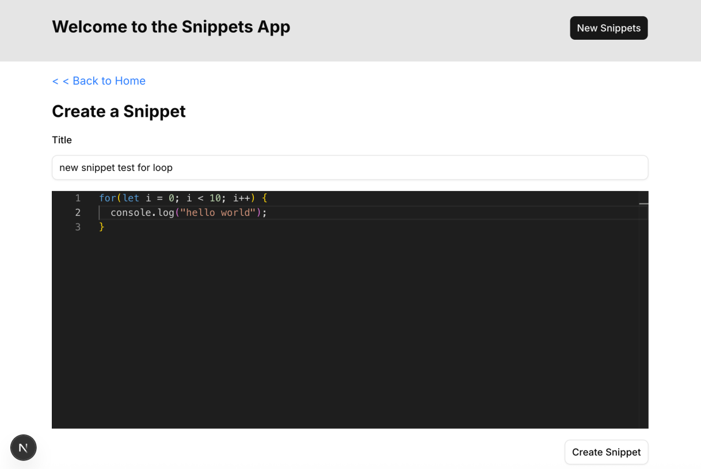
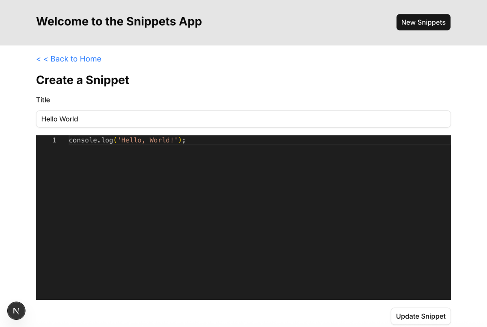

# Step 04 — Create & Edit

Goal: add a Create page for new snippets and an Edit page to update existing ones, both powered by Monaco Editor and Server Actions.

---

## 1. Create Page

The create page lives at `/snippets`. It's a form — the user fills in a title and writes code in the Monaco Editor, then submits.

```tsx
// app/snippets/page.tsx
import { createSnippet } from "@/db";
import { redirect } from "next/navigation";
import Link from "next/link";
import MonacoEditor from "@/components/CodeEditor";
import { Button } from "@/components/ui/button";
import { Input } from "@/components/ui/input";
import { Field, FieldLabel } from "@/components/ui/field";
import { revalidatePath } from "next/cache";

export default function CreateSnippetPage() {
  async function actionCreateSnippet(formData: FormData): Promise<void> {
    "use server";
    const title = formData.get("title") as string;
    const code = formData.get("code") as string;
    const response = await createSnippet(title, code);
    console.log("Create Snippet Response:", response);
    revalidatePath("/");
    redirect("/");
  }

  return (
    <form action={actionCreateSnippet} className="w-full max-w-4xl p-4 flex flex-col gap-4">
      <Link href="/" className="text-blue-500 hover:underline">
        &lt; &lt; Back to Home
      </Link>

      <h2 className="text-2xl font-bold">Create a Snippet</h2>

      <Field>
        <FieldLabel htmlFor="title">Title</FieldLabel>
        <Input id="title" name="title" type="text" placeholder="title..." required />
      </Field>

      <MonacoEditor defaultValue="// Write your code here" />
      <div className="flex justify-end">
        <Button variant="outline" type="submit" className="cursor-pointer">
          Create Snippet
        </Button>
      </div>
    </form>
  );
}
```

`Field` wraps a label-input pair and handles layout and accessibility (`role="group"`). `FieldLabel` renders a `<label>` with the correct `data-slot` attributes that `Field` uses for styling. This replaces a plain `<div>` + `<label>` with a semantic, consistent pattern.



Notice that the Server Action (`actionCreateSnippet`) is defined **inside** the page component as a nested function. This is valid in Next.js — the `"use server"` directive promotes it to a Server Action regardless of where it's defined.

After a successful create, `redirect("/")` sends the user back to the home page. `revalidatePath("/")` ensures the home page re-fetches its data so the new snippet appears immediately.

---

## 2. The Monaco Editor Problem

The Monaco Editor is a fully interactive client-side component. It doesn't render a standard `<textarea>` or `<input>`, so when the form is submitted, its value won't appear in `FormData` automatically.

**Solution: a hidden `<input>` as a bridge.**

```
User types in Monaco Editor
         ↓
  onChange callback fires
         ↓
  React state (useState) updated
         ↓
  hidden <input> value kept in sync
         ↓
  Form submits → FormData includes the code
```

```tsx
// components/CodeEditor.tsx
"use client";
import { useState } from "react";
import Editor from "@monaco-editor/react";

interface CodeEditorProps {
  defaultValue: string;
}

export default function CodeEditor({ defaultValue }: CodeEditorProps) {
  const [code, setCode] = useState(defaultValue);

  const handleChange = (value: string | undefined) => {
    setCode(value || "");
  };

  return (
    <div className="flex flex-col gap-4">
      {/* The visible, interactive editor */}
      <Editor
        height="50vh"
        language="typescript"
        defaultValue={code}
        onChange={handleChange}
        theme="vs-dark"
        options={{
          minimap: { enabled: false },
          fontSize: 14,
          tabSize: 2,
        }}
      />

      {/* The hidden input that carries the value into FormData */}
      <input type="hidden" name="code" value={code} />
    </div>
  );
}
```

This is a common pattern when integrating rich editors (Monaco, Quill, CodeMirror, etc.) with traditional form submissions. The hidden input is the glue between the custom editor's state and the native form mechanism that Server Actions rely on.

Note the difference from `CodeViewer` in Step 03:

| Component    | Purpose        | `readOnly` | `onChange` | `hidden input` |
| ------------ | -------------- | ---------- | ---------- | -------------- |
| `CodeViewer` | Display only   | Yes        | No         | No             |
| `CodeEditor` | Editable input | No         | Yes        | Yes            |

---

## 3. Link "New Snippet" Button on the Home Page

Update the Header to include a button that navigates to the create page:

```tsx
// app/components/Header.tsx
import { Button } from "@/components/ui/button";
import Link from "next/link";

export default function Header() {
  return (
    <div className="w-full border-b h-24 bg-neutral-200 flex items-center justify-center">
      <div className="w-full max-w-4xl flex justify-between p-4">
        <h1 className="text-2xl font-bold">Welcome to the Snippets App</h1>
        <Button asChild>
          <Link href="/snippets">New Snippets</Link>
        </Button>
      </div>
    </div>
  );
}
```

---

## 4. Edit Page — Dynamic Route with Pre-filled Data

The edit page lives at `/snippets/[id]/edit`. It fetches the existing snippet, pre-fills the form, and saves changes on submit.

```tsx
// app/snippets/[id]/edit/page.tsx
import { getSnippetById, updateSnippetById } from "@/db";
import { notFound, redirect } from "next/navigation";
import Link from "next/link";
import MonacoEditor from "@/components/CodeEditor";
import { Button } from "@/components/ui/button";
import { Input } from "@/components/ui/input";
import { Field, FieldLabel } from "@/components/ui/field";
import { revalidatePath } from "next/cache";

interface EditSnippetPageProps {
  params: Promise<{ id: string }>;
}

export default async function EditSnippetPage({ params }: EditSnippetPageProps) {
  const { id } = await params;
  const snippet = await getSnippetById(Number(id));

  if (!snippet) {
    return notFound();
  }

  async function actionUpdateSnippet(formData: FormData): Promise<void> {
    "use server";
    const title = formData.get("title") as string;
    const code = formData.get("code") as string;
    const response = await updateSnippetById(Number(id), title, code);
    revalidatePath("/");
    redirect("/");
  }

  return (
    <form action={actionUpdateSnippet} className="w-full max-w-4xl p-4 flex flex-col gap-4">
      <Link href="/" className="text-blue-500 hover:underline">
        &lt; &lt; Back to Home
      </Link>

      <h2 className="text-2xl font-bold">Edit Snippet</h2>

      <Field>
        <FieldLabel htmlFor="title">Title</FieldLabel>
        <Input id="title" name="title" type="text" placeholder="title..." required defaultValue={snippet.title} />
      </Field>

      <MonacoEditor defaultValue={snippet.code} />
      <div className="flex justify-end">
        <Button variant="outline" type="submit" className="cursor-pointer">
          Update Snippet
        </Button>
      </div>
    </form>
  );
}
```



The edit page is nearly identical to the create page, with two differences:

1. It fetches the existing snippet first and passes its data as `defaultValue` to the form fields
2. The Server Action calls `updateSnippetById` instead of `createSnippet`

If the snippet doesn't exist (e.g., someone navigates to `/snippets/999/edit`), `notFound()` renders the custom 404 page.

---

## 5. Full Route Map

Here's the complete routing structure for the finished app:

```
app/
├── layout.tsx                   # Root layout with Header
├── not-found.tsx                # Global 404 page
├── page.tsx                     # GET /          → snippet list
└── snippets/
    ├── page.tsx                 # GET /snippets  → create form
    └── [id]/
        ├── page.tsx             # GET /snippets/[id]       → view
        └── edit/
            └── page.tsx         # GET /snippets/[id]/edit  → edit form
```

All four pages (list, create, view, edit) share the same `Header` from `layout.tsx`.

---

## 6. Data Flow Summary

```
Create:
  User fills form → submits → actionCreateSnippet (Server Action)
  → createSnippet() → DB insert → revalidatePath("/") → redirect("/")

Edit:
  Page loads → getSnippetById() → pre-fill form
  User edits → submits → actionUpdateSnippet (Server Action)
  → updateSnippetById() → DB update → revalidatePath("/") → redirect("/")

Delete (from Step 03):
  User clicks Delete → deleteSnippet (Server Action)
  → deleteSnippetById() → DB delete → revalidatePath("/") → page re-renders
```

---

## Summary

| Concept              | Key Point                                                           |
| -------------------- | ------------------------------------------------------------------- |
| Nested Server Action | `"use server"` works inside page component functions too            |
| `redirect()`         | Navigates the user after a successful form submission               |
| Hidden input bridge  | Sync Monaco Editor state → `<input type="hidden">` → FormData       |
| Pre-filling forms    | Pass `defaultValue` prop to `Input` and `CodeEditor` for edit pages |
| `notFound()`         | Works in edit pages too — gracefully handles invalid IDs in the URL |
